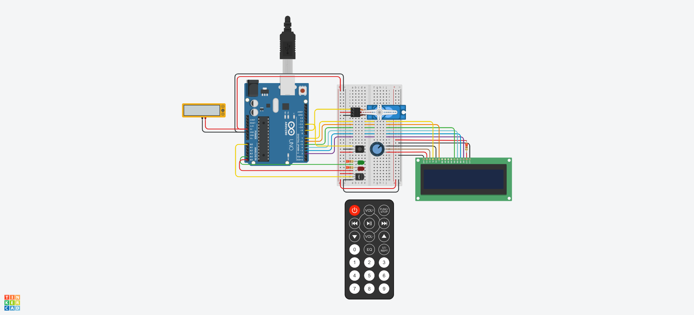

# Segundo Parcial - Sistema de incendios

## Alumno
- Ortiz Ferreira Julian Ezequiel

## Descripción
Este proyecto es un detector de incendios con sensor de temperatura, el cual se enciende y apaga via control
remoto IR. El mismo muestra la estacion del año y la temperatura actual, y acciona el sistema contra propagacion
de incendios en caso de detectar una temperatura igual o mayor a 60°C.

## Proyecto: Sistema de incencios

## Funcionamiento integral
Al conectar el dipositivo, el mismo enciende el sensor IR para detectar las pulsaciones de tecla del control 
remoto. Cuando detecta que fue presionada la tecla de encendido, enciende el sensor de temperatura, que permitira
determinar el rango (Estacion) en la que se encuentra la misma. En caso de encontrarse dentro de los parametros 
normales, muestra por el Display la estacion del año, la temperatura y a su vez, hace titilar la luz led verde. 
De lo contrario, si la temperatura excede los 60°C, muestra una alerta por Display, con la temperatura, enciende 
la luz roja titilante y activa el sistema contra propagacion de incendios. 
El dispositivo puede apagarse mediante la tecla stop del control remoto en cualquier momento ya que el sensor IR 
funciona permanentemente mientras el dispositivo está conectado. 

Consta de:
  - Receptor infrarojo para su encencido y apagado.
  - Sensor de temperatura.
  - Luces led indicadoras titilantes (Verde: Normal, Rojo: Alerta).
  - Display indicador de temperatura y estacion del año.
  - Servomotor (Simula el sistema contra propagacion de incendio).

## Función principal
Esta funcion es la que se ejecuta al encender el sistema via control remoto.
La misma obtiene la temperatura del ambiente, necesaria para accionar todos los procesos mencionados anteriormente.

~~~ C(lenguaje en el que esta escrito)
  void encender_sistema()
  {
      float lectura = analogRead(A0);
      float temperatura = map(lectura, 20, 358, -40, 125);
      char* estacion = Determinar_Estacion(temperatura);
      mostrar_en_display(estacion, temperatura);
  }
~~~

## :robot: Link al proyecto
- [ProyectoSistemaDeIncendios](https://www.tinkercad.com/things/cj74DD99GCz-2do-parcial-spd-ortiz-julian/editel?sharecode=QI7dvXrKGvJYSEOya7offppAgA9XnaaDT6DKT0bqQ40)

## Link código GDB
- [CodigoGDB](https://onlinegdb.com/SWDibtL6B)